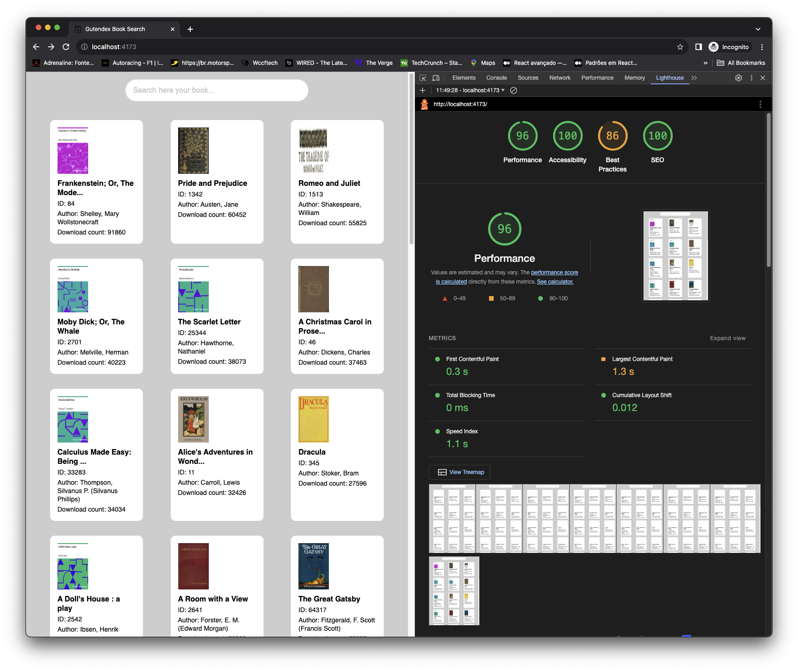

# Project Gutenberg - Front-End

## Overview

This React application is a showcase of books from the project Gutenberg, thats is good source of free eBooks. 

Here you can search books and get details of them

The application was built using TypeScript and Vite, React Query, CSS-in-JS (emotion similar to styled components) and Cypress for E2E testing.

## Setup

It is recommended to use the LTS version of node 20.10

Steps to run the project locally:

1. Clone the repository on Github.

2. Install dependencies:
   ```bash
   npm install
   ```
3. Start the development server:
   ```bash
   npm run dev
   ```
4. Build the app for production:
   ```bash
   npm run build
   ```
4. Run the E2E tests:
   ```bash
   npm run cypress
   ```

## Features

- **Book ShowCase**: Displays a collection of eBooks from Project Gutenberg. 
- **Search Functionality**: Allows users to search for books by title or author.
- **Pagination Functionality**: An infinite scroll concept has been implemented for pagination, using React Suspense and React Infinity Query.
- **Book Details**: Shows more information about the book.
- **Error Handling**: Used Error Boundary technique to catch any error.
- **Favorites**: Unfortunately I was not able to develop this feature in time for the deadline. 

## Project Folder Structure

- `src`: Contains the source code of the application.
  - `src/App.tsx`: The main component that includes the routing logic and layout structure.
  - `src/components`: Reusable components such as book cards and detail views.
  - `assets`: Static assets such as png images and SVG.
  - `src/services`: Utility like api, dictionary-texts helper functions and route.
  - `src/hooks`: Custom hooks for shared logic.
  - `src/styles`: Global styles and reusables.
- `cypress`: E2E folder, with specs.   
- `public`: Publicly accessible assets. 


## Performance

Here I didn't do anything special to improve the performance but in tests on the lighthouse/chrome the result was decent overall. 

PS: I was just concern to not overuse useEffect, but I didn't use anything like useCallback, memo or useMemo.



How did I test it: 
 - After build the project and run a preview; 
 - Open in to a new incognito page with the url default http://localhost:4173/
 - In Chrome > More Tools > Developer Tools, click on lighthouse - device desktop. 


## About Tests

Here I would have liked to put unit tests using react-testing-library+Jest but due to 
the deadline I chose a more general approach using E2E with cypress. 


## Project Technologies:

- React
- Typescript
- Emotion
- React Router DOM
- Eslint
- Vitest
- Cypress
- Node (LTS)
